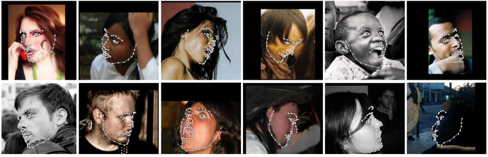

# Face Recognition

Detect facial landmarks from Python using the world's most accurate face alignment network, capable of detecting points in both 2D and 3D coordinates.

Build using [FAN](https://www.adrianbulat.com)'s state-of-the-art deep learning based face alignment method. 

<p align="center"></p>

**Note:** The lua version is available [here](https://github.com/1adrianb/2D-and-3D-face-alignment).

For numerical evaluations it is highly recommended to use the lua version which uses indentical models with the ones evaluated in the paper. More models will be added soon.

[](https://opensource.org/licenses/BSD-3-Clause)  [](https://github.com/1adrianb/face-alignment/actions?query=workflow%3A%22Test+Face+alignmnet%22) [](https://anaconda.org/1adrianb/face_alignment)
[](https://pypi.org/project/face-alignment/)

## Features

#### Detect 2D facial landmarks in pictures

<p align='center'>
</img>
</p>

```python
import face_alignment
from skimage import io

fa = face_alignment.FaceAlignment(face_alignment.LandmarksType.TWO_D, flip_input=False)

input = io.imread('../test/assets/aflw-test.jpg')
preds = fa.get_landmarks(input)
```

#### Detect 3D facial landmarks in pictures

<p align='center'>
</img>
</p>

```python
import face_alignment
from skimage import io

fa = face_alignment.FaceAlignment(face_alignment.LandmarksType.THREE_D, flip_input=False)

input = io.imread('../test/assets/aflw-test.jpg')
preds = fa.get_landmarks(input)
```

#### Process an entire directory in one go

```python
import face_alignment
from skimage import io

fa = face_alignment.FaceAlignment(face_alignment.LandmarksType.TWO_D, flip_input=False)

preds = fa.get_landmarks_from_directory('../test/assets/')
```

#### Detect the landmarks using a specific face detector.

By default the package will use the SFD face detector. Pass `face_detector` to switch:

```python
import face_alignment

fa = face_alignment.FaceAlignment(face_alignment.LandmarksType.TWO_D, face_detector='sfd')
```

#### Supported face detectors

The library supports multiple face detection backends. SFD is the default and most accurate, but slower alternatives like BlazeFace, YuNet, or RetinaFace offer better speed. SCRFD requires the optional `onnxruntime` package (`pip install onnxruntime`).

| Detector | `face_detector=` | CPU (ms) | MPS (ms) | PyTorch device |
|---|---|---|---|---|
| [**SFD**](https://arxiv.org/abs/1708.05237) | `'sfd'` | 138.8 | 33.1 | CPU / CUDA / MPS |
| [**BlazeFace**](https://arxiv.org/abs/1907.05047) | `'blazeface'` | 10.9 | 8.2 | CPU / CUDA / MPS |
| [**YuNet**](https://link.springer.com/article/10.1007/s11633-023-1423-y) | `'yunet'` | 5.6 | N/A | CPU only (OpenCV DNN) |
| [**RetinaFace**](https://arxiv.org/abs/1905.00641) | `'retinaface'` | 25.2 | 15.5 | CPU / CUDA / MPS |
| [**SCRFD**](https://arxiv.org/abs/2105.04714) | `'scrfd'` | 23.1 | N/A | CPU only (ONNX Runtime) |
| **dlib** *(deprecated)* | `'dlib'` | — | — | CPU / CUDA |

*Timings: detection only, median over 20 runs, single face 450x450 image, Apple M2.*

You can also skip detection entirely by passing `face_detector='folder'`, which loads pre-computed bounding boxes from `.npy`, `.t7`, or `.pth` files matching each image filename. This is useful for evaluation with ground truth boxes.

```python
import face_alignment

# BlazeFace back camera model (larger input, better for distant faces)
fa = face_alignment.FaceAlignment(face_alignment.LandmarksType.TWO_D, face_detector='blazeface',
                                  face_detector_kwargs={'back_model': True})

# SCRFD (requires: pip install onnxruntime)
fa = face_alignment.FaceAlignment(face_alignment.LandmarksType.TWO_D, face_detector='scrfd')

# Use pre-computed bounding boxes from files alongside images
fa = face_alignment.FaceAlignment(face_alignment.LandmarksType.TWO_D, face_detector='folder')
```

#### Running on CPU/GPU
In order to specify the device (GPU or CPU) on which the code will run one can explicitly pass the device flag.
The landmark network is compiled with `torch.compile` by default for faster inference. Compilation artifacts are cached to disk, so only the first run is slow (~25s). Pass `compile=False` to disable.

```python
import torch
import face_alignment

# cuda for CUDA, mps for Apple M GPUs.
fa = face_alignment.FaceAlignment(face_alignment.LandmarksType.TWO_D, dtype=torch.bfloat16, device='cuda')

# Skip compilation for instant startup
fa = face_alignment.FaceAlignment(face_alignment.LandmarksType.TWO_D, device='cpu', compile=False)
```

Please also see the ``examples`` folder

## Installation

### Requirements

* Python 3.9+
* Linux, Windows or macOS
* PyTorch (>=2.0)

While not required, for optimal performance(especially for the detector) it is **highly** recommended to run the code using a CUDA enabled GPU.

### Binaries

The easiest way to install it is using either pip or conda:

| **Using pip**                | **Using conda**                            |
|------------------------------|--------------------------------------------|
| `pip install face-alignment` | `conda install -c 1adrianb face_alignment` |
|                              |                                            |

Alternatively, bellow, you can find instruction to build it from source.

### From source

 Install pytorch and pytorch dependencies. Please check the [pytorch readme](https://github.com/pytorch/pytorch) for this.

#### Get the Face Alignment source code
```bash
git clone https://github.com/1adrianb/face-alignment
```
#### Install the Face Alignment lib
```bash
pip install -r requirements.txt
pip install .
```

### Docker image

A Dockerfile is provided to build images with cuda support and cudnn. For more instructions about running and building a docker image check the orginal Docker documentation.
```
docker build -t face-alignment .
```

## How does it work?

While here the work is presented as a black-box, if you want to know more about the intrisecs of the method please check the original paper either on arxiv or my [webpage](https://www.adrianbulat.com).

## Contributions

All contributions are welcomed. If you encounter any issue (including examples of images where it fails) feel free to open an issue. If you plan to add a new features please open an issue to discuss this prior to making a pull request.

## Citation

```
@inproceedings{bulat2017far,
  title={How far are we from solving the 2D \& 3D Face Alignment problem? (and a dataset of 230,000 3D facial landmarks)},
  author={Bulat, Adrian and Tzimiropoulos, Georgios},
  booktitle={International Conference on Computer Vision},
  year={2017}
}
```

For citing dlib, pytorch or any other packages used here please check the original page of their respective authors.

## Acknowledgements

* To the [pytorch](http://pytorch.org/) team for providing such an awesome deeplearning framework
* To [my supervisor](http://www.cs.nott.ac.uk/~pszyt/) for his patience and suggestions.
* To all other python developers that made available the rest of the packages used in this repository.